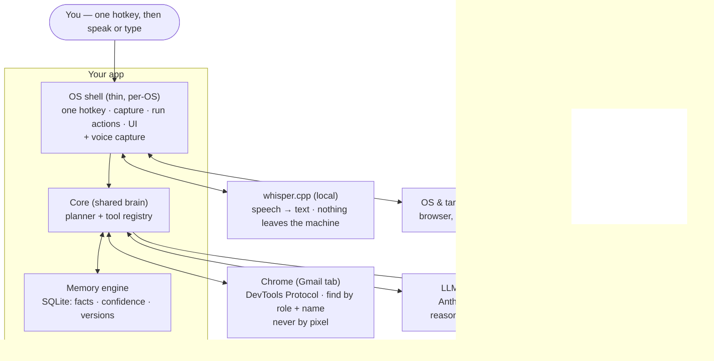
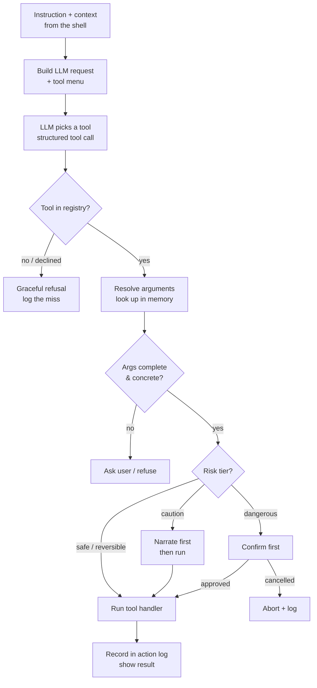
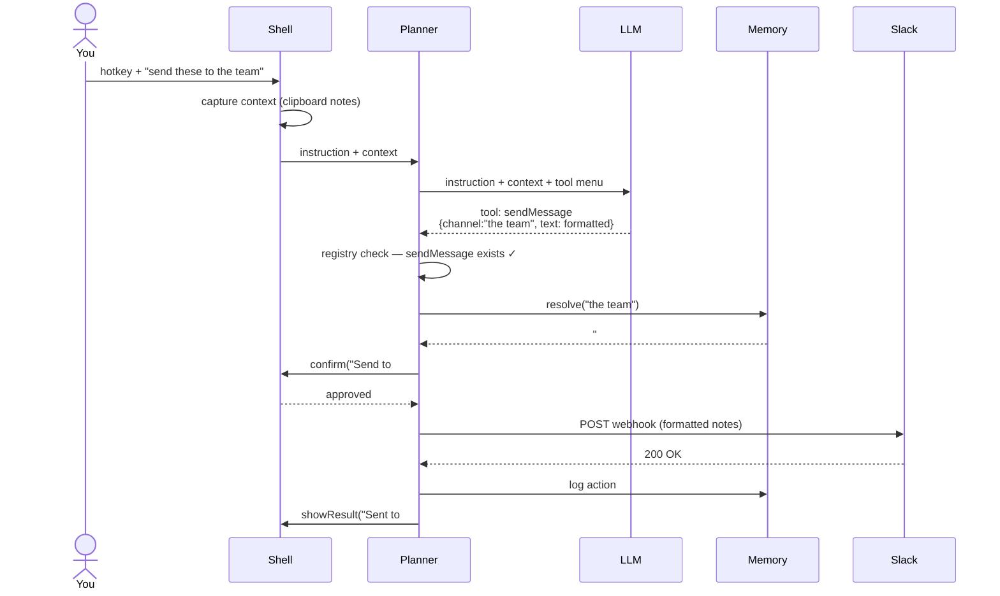
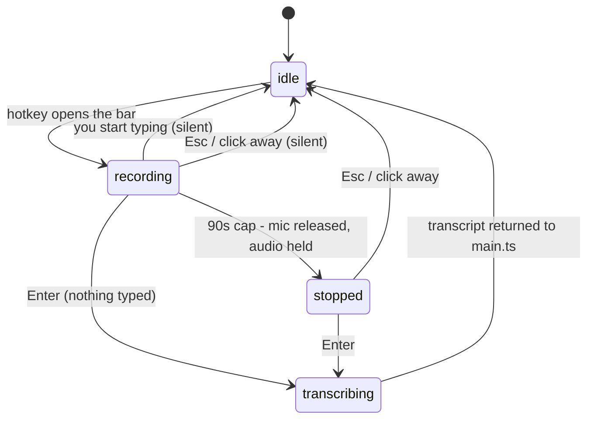
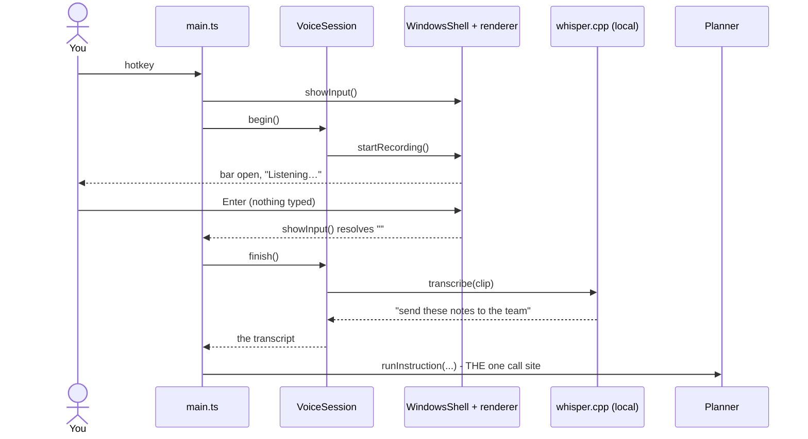
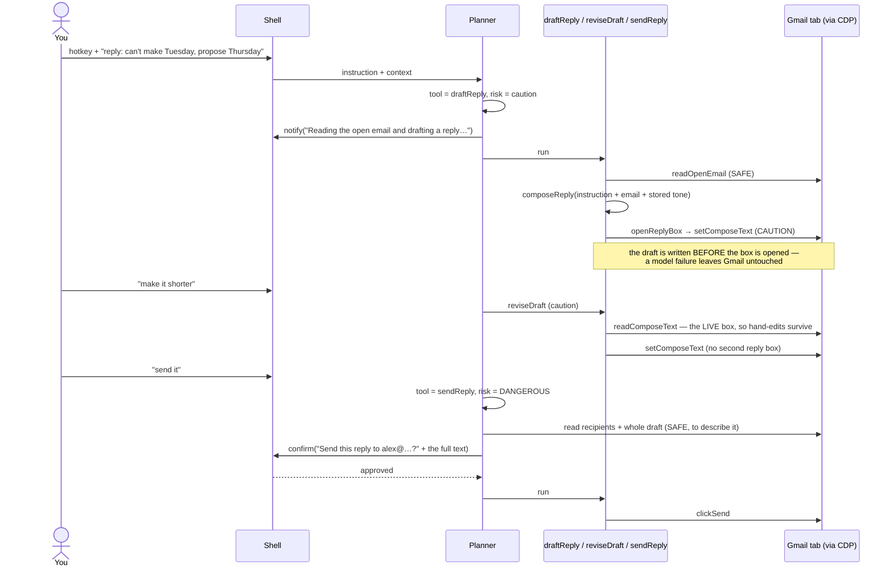
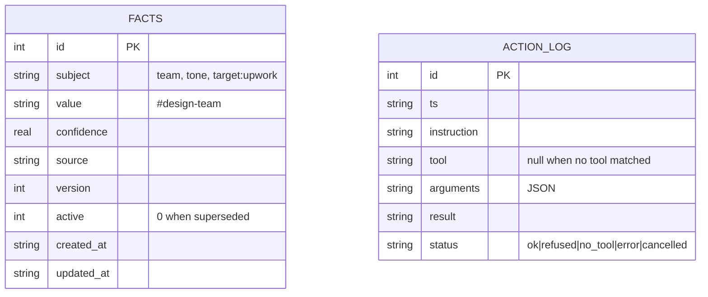

# ARCHITECTURE.md — Voice-Action Agent

Documentation of how the app is put together and how a request flows through it.
All diagrams are Mermaid, so they render directly on GitHub / most Markdown viewers.
For scope, stack, and build tasks, see `spec.md`.

---

## 1. One-line mental model

The app is a **translator**: it takes three inputs — what you *typed*, what you're
*looking at*, and what it *remembers about you* — and turns them into exactly one
concrete action.

```
instruction + context + memory  ──►  one exact function call  ──►  one result
```

Everything below is the machinery that makes that translation reliable.

---

## 2. Component architecture

Three layers own the work. The shell is thin and per-OS; the core and memory are
shared and portable. The LLM and Slack are external services the app talks to.



**Where voice sits:** entirely in the shell. It converts speech into the same string the
command bar would have returned, and hands it to the same call site. The core never
learns it exists — which is why voice changed no file in `/core` except adding one interface.

**Read it as:** you sit at the top; the stacked boxes are *your* app; the boxes on
the right are things the app uses but does not own. The shell is the only part that
knows it's on Windows.

### What each piece does
- **OS shell** — the hands and ears. Notices the hotkey, grabs context (clipboard
  text + active window), carries out local actions (open URL, copy, notify), and
  shows the command bar / result / confirm dialogs. Makes no decisions. This is the
  only layer you rewrite per OS, and it sits behind the `OSShell` interface.
- **Core** — the brain, identical on every OS. The *tool registry* is the menu of
  things the app can do; the *planner* runs the loop that turns an instruction into
  one validated tool call.
- **Memory engine** — makes it *yours*. Resolves vague references before acting
  ("the team" → `#design-team`) and records facts after. This is the differentiator.
- **Gmail surface (M10)** — the one app the brain can act *inside*. Behind the `GmailSurface`
  interface like everything else external, so tests run against a fake tab. It finds controls by
  their real role and accessible name over the DevTools Protocol; it never clicks a coordinate,
  and it refuses outright when a control is missing or ambiguous.
- **LLM / Slack / Chrome / OS** — rented reasoning, the external actions, and the things
  the shell's hands touch.

---

## 3. The planner loop (what happens inside the core)

The single path every command takes. Simple tasks skip the memory and Slack steps;
the skeleton never changes.



**The one rule that matters:** the LLM *proposes*, the planner *disposes*. The
registry check, the validation, and the risk gates are deterministic code — the
model never gets to invent a capability or fire a dangerous action unchecked.

**The four tiers (M10, `core/risk.ts`).** A boolean `irreversible` was enough while every
action was either an undoable local transform or one Slack POST. Acting inside another app's
GUI broke that — most GUI actions have no undo — so the question split in two: *is it
recoverable* and *how much does it cost when it is wrong*.

| Tier | Example | What happens |
|------|---------|--------------|
| `safe` | read the open email | run |
| `reversible` | copy to clipboard, open a tab, version a fact | run |
| `caution` | open the reply box, insert a draft | run, **after saying so** |
| `dangerous` | Slack post, Gmail Send | **confirm first**, always |

Narration is what stands in for the undo that does not exist: by the time the reply box is
open there is nothing to roll back, so being told while it happens is the protection.

---

## 4. Request lifecycle — a concrete trace

"Send these meeting notes to the team." This sequence shows every hop, including the
memory lookup and the confirm gate.



**Correction follow-up ("no, I meant the design channel"):** the planner routes this
to the `remember` tool, which versions the old `team` fact inactive and writes a new
one. The *next* send resolves to the corrected channel. That behavior — a correction
that sticks — is the thing a plain prompt can't fake, and it's the flagship demo.

---

## 4a. Voice input — one hotkey, explicit state

Dictation is a *second way to produce the instruction string*, nothing more. **One** hotkey
opens the command bar and starts listening at the same moment, so you choose between
speaking and typing *after* the bar is up. `Enter` submits either way.



Four properties are what make one hotkey safe rather than fiddly:

- **Typing silently cancels the recording.** No message, no stray transcript arriving behind
  the text you typed. Typing is not an error, so it must not produce output.
- **The 90-second cap releases the microphone but transcribes nothing.** Holding the mic open
  is the real harm; whisper work on audio you may never submit is waste. The bar says it
  stopped, and `Enter` still runs what you said.
- **Nothing ever fires on its own.** Every path to the planner goes through your `Enter`.
- **Every failure returns to `idle`** — blocked mic, whisper crash, blank transcript, clip
  too short. The hotkey is never left dead.



The load-bearing detail is that `VoiceSession` never calls the planner. `main.ts` **pulls** a
transcript and feeds it to the same `runInstruction` a typed instruction uses, so there is
exactly one planner call site and a dictated instruction is indistinguishable from a typed
one in the action log.

**One capture at a time.** `showInput()` keeps its resolver on the shell instance rather than
registering a listener per call, and every way of hiding the bar ends that capture. An
earlier design registered per-call IPC listeners that only a submit or an Escape could
remove, so clicking the bar away stranded one — and every stranded listener fired on the
next submit, running the planner once per abandoned opening. Measured at six concurrent runs
(twelve LLM calls) from a single keystroke before the fix.

---

## 4b. The Gmail reply flow (M10)

Read the open email, draft a reply in your tone, put it in the box, tweak it, send only on an
explicit yes. Two `caution` steps run on their own after announcing themselves; the one
`dangerous` step cannot.



**Where the refusals are.** Every arrow into Gmail can end in an honest "no": no message open,
no reply box, more than one Gmail tab matching, a control that cannot be found, a control that
matches more than once. None of them fall back to guessing, which is what makes a Gmail redesign
show up as a refusal rather than a wrong click.

---

## 5. Memory data model

Two tables. `facts` carries the epistemic metadata (confidence, version, active) so
corrections and contradictions are first-class, not overwrites. `action_log` doubles
as the "missing tool" backlog.



**Why versioning instead of overwrite:** when you correct a fact, the old row is
kept with `active = 0` and a new row is written at `version + 1`. That's what turns
"personalization" from a static profile into a memory that evolves and can explain
itself — and it's the seam where this app plugs into the larger personal-OS engine.

---

## 6. What makes this reliable (design invariants)

- **Closed world.** The app can only do the six registered tools. "Not on the menu"
  → honest refusal, never a wrong action. This is what makes it demoable.
- **Thin shell.** All OS-specific code sits behind `OSShell` (and `VoiceShell` for
  microphone capture). The core imports no `electron`. Porting = reimplementing those
  interfaces, nothing else.
- **Input is interchangeable.** Typed and spoken instructions converge on one call site
  before the planner ever runs, so voice cannot become a way around the confirm gate.
- **Propose vs dispose.** The LLM's output is a *proposal* the planner validates
  before anything runs. `dangerous` actions always pass a confirm gate; `caution` actions
  always announce themselves first (§3).
- **Default-deny on anything unidentified.** A GUI control that resolves to zero elements —
  or to more than one — is never touched. "I can see three things that look like Reply" is a
  refusal, not a coin flip. This is the rule that keeps a UI change from becoming a wrong click.
- **Testable core.** A `MockShell` lets the whole brain + memory run headless, so
  the eval suite runs in CI without a desktop.
- **Misses are signal.** Every unregistered request is logged — a ranked backlog of
  the next tools to build, drawn from real usage.

---

## 7. Where v1+ goes (not built in v0)

- ~~Voice / speech-to-text on the front of the loop (whisper.cpp, local).~~ **Built in
  M7** — see §4a.
- Generalize the single Slack action into MCP connectors (Teams, mail, calendar).
- A clipboard-only `compose` tool: `core/compose.ts` is already app-agnostic, so an
  instruction-driven draft that works in any app is a tool file, not a new subsystem.
- More apps behind `GmailSurface`'s pattern (Outlook web, Slack) — each needs its own live
  verification, but the finding-by-role-and-name approach transfers.
- Mac and Linux shells behind the same `OSShell` + `VoiceShell` interfaces.
- Multi-step plans and a real agent loop (the closed→open world jump).
- Point the memory engine at the Postgres/Neon personal OS instead of local SQLite.
