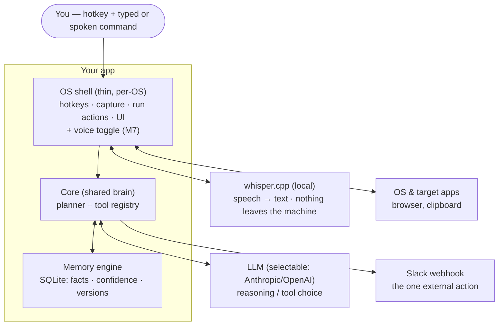
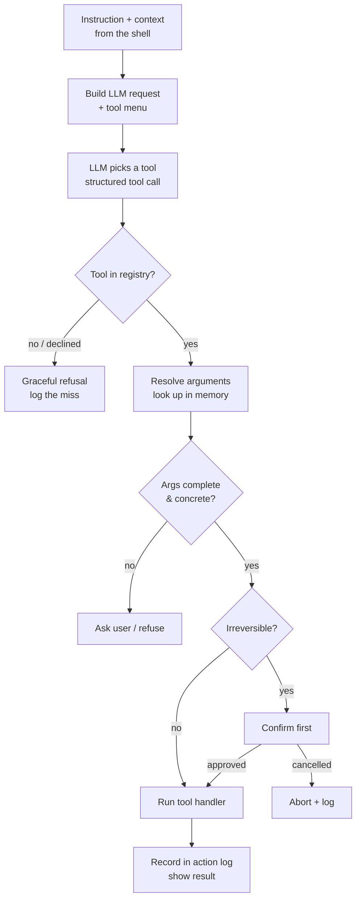
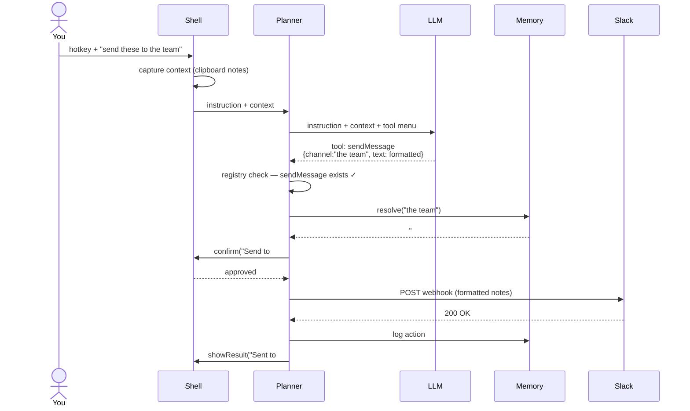
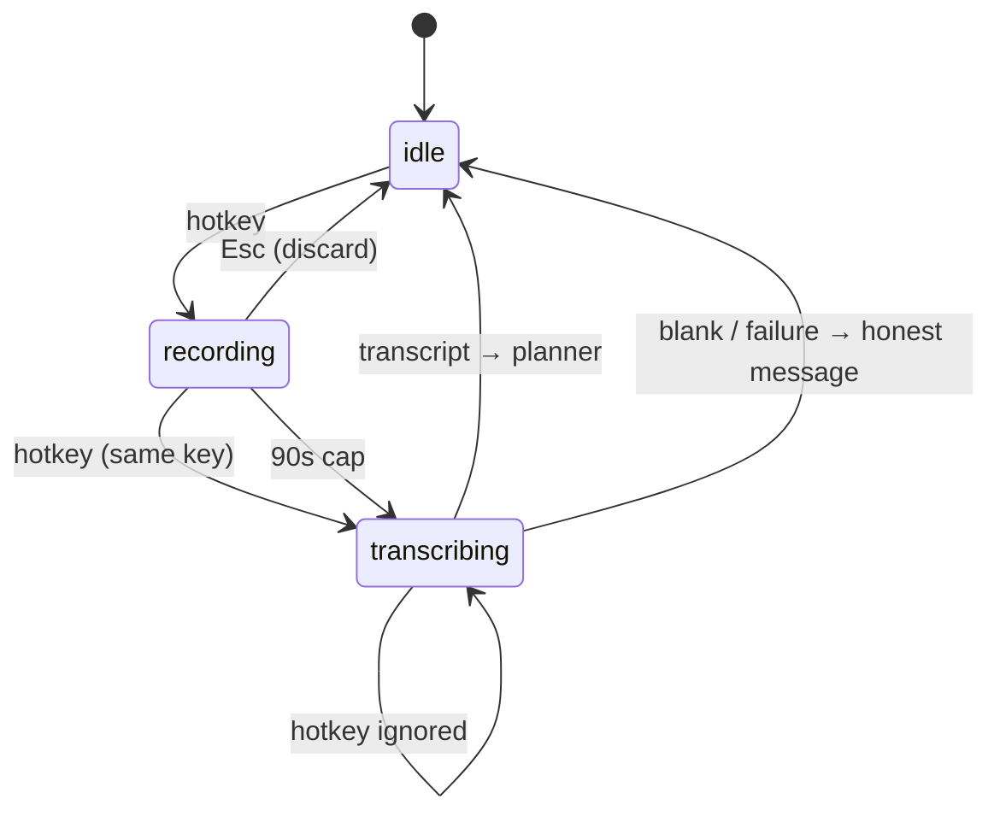
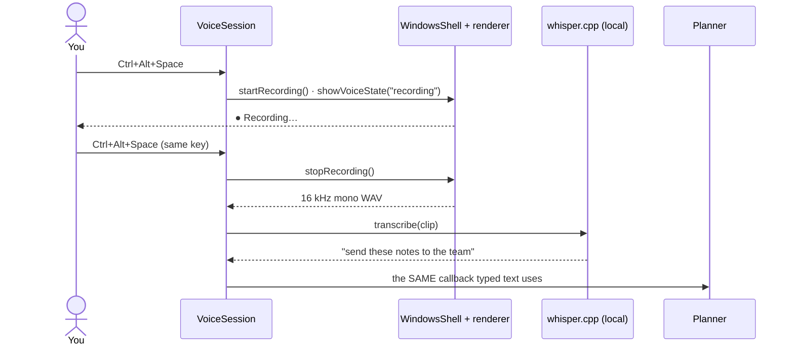
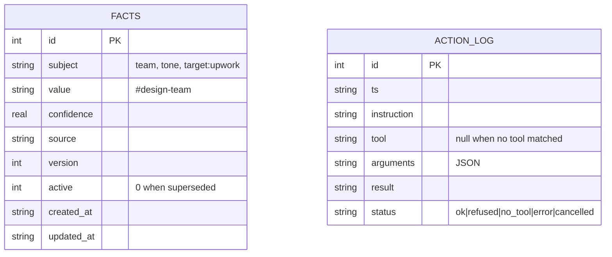

# ARCHITECTURE.md — Voice-Action Agent

Documentation of how the app is put together and how a request flows through it.
All diagrams are Mermaid, so they render directly on GitHub / most Markdown viewers.
For scope, stack, and build tasks, see `spec.md`.

---

## 1. One-line mental model

The app is a **translator**: it takes three inputs — what you *typed*, what you're
*looking at*, and what it *remembers about you* — and turns them into exactly one
concrete action.

```
instruction + context + memory  ──►  one exact function call  ──►  one result
```

Everything below is the machinery that makes that translation reliable.

---

## 2. Component architecture

Three layers own the work. The shell is thin and per-OS; the core and memory are
shared and portable. The LLM and Slack are external services the app talks to.



**Where voice sits:** entirely in the shell. It converts speech into the same string the
command bar would have returned, and hands it to the same call site. The core never
learns it exists — which is why M7 changed no file in `/core` except adding one interface.

**Read it as:** you sit at the top; the stacked boxes are *your* app; the boxes on
the right are things the app uses but does not own. The shell is the only part that
knows it's on Windows.

### What each piece does
- **OS shell** — the hands and ears. Notices the hotkey, grabs context (clipboard
  text + active window), carries out local actions (open URL, copy, notify), and
  shows the command bar / result / confirm dialogs. Makes no decisions. This is the
  only layer you rewrite per OS, and it sits behind the `OSShell` interface.
- **Core** — the brain, identical on every OS. The *tool registry* is the menu of
  things the app can do; the *planner* runs the loop that turns an instruction into
  one validated tool call.
- **Memory engine** — makes it *yours*. Resolves vague references before acting
  ("the team" → `#design-team`) and records facts after. This is the differentiator.
- **LLM / Slack / OS** — rented reasoning, the one external action, and the things
  the shell's hands touch.

---

## 3. The planner loop (what happens inside the core)

The single path every command takes. Simple tasks skip the memory and Slack steps;
the skeleton never changes.



**The one rule that matters:** the LLM *proposes*, the planner *disposes*. The
registry check, the validation, and the confirm gate are deterministic code — the
model never gets to invent a capability or fire an irreversible action unchecked.

---

## 4. Request lifecycle — a concrete trace

"Send these meeting notes to the team." This sequence shows every hop, including the
memory lookup and the confirm gate.



**Correction follow-up ("no, I meant the design channel"):** the planner routes this
to the `remember` tool, which versions the old `team` fact inactive and writes a new
one. The *next* send resolves to the corrected channel. That behavior — a correction
that sticks — is the thing a plain prompt can't fake, and it's the flagship demo.

---

## 4a. Voice input (M7) — one hotkey, explicit state

Dictation is a *second way to produce the instruction string*, nothing more. One hotkey
(`Ctrl+Alt+Space`, or the first free fallback — see spec §4a) both starts and stops, so
the current **state** decides what a press means — never timing, never how long the key
was held.



Three properties are what make the toggle safe rather than fiddly:

- **A press while `transcribing` is ignored.** Starting a fresh capture there would race
  the transcript already in flight, and the user could not tell which one produced the
  action. The bar reads `Transcribing…`, so the no-op is visible rather than mysterious.
- **The 90-second cap runs the *same* stop path**, so a recording you walked away from
  still transcribes and still acts — it just stops deciding for itself when.
- **Every failure returns to `idle`.** Blocked microphone, whisper crash, blank
  transcript, sub-300 ms clip: all land back at `idle` with an honest message, so the
  hotkey is never left dead.



The load-bearing detail is that last arrow: `VoiceSession` never calls the planner
itself. It hands the transcript to the `runInstruction` callback in `main.ts` — the one
`showInput()` already feeds — so there is exactly **one planner call site** and a
dictated instruction is indistinguishable from a typed one in the action log.

---

## 5. Memory data model

Two tables. `facts` carries the epistemic metadata (confidence, version, active) so
corrections and contradictions are first-class, not overwrites. `action_log` doubles
as the "missing tool" backlog.



**Why versioning instead of overwrite:** when you correct a fact, the old row is
kept with `active = 0` and a new row is written at `version + 1`. That's what turns
"personalization" from a static profile into a memory that evolves and can explain
itself — and it's the seam where this app plugs into the larger personal-OS engine.

---

## 6. What makes this reliable (design invariants)

- **Closed world.** The app can only do the six registered tools. "Not on the menu"
  → honest refusal, never a wrong action. This is what makes it demoable.
- **Thin shell.** All OS-specific code sits behind `OSShell` (and `VoiceShell` for
  microphone capture). The core imports no `electron`. Porting = reimplementing those
  interfaces, nothing else.
- **Input is interchangeable.** Typed and spoken instructions converge on one call site
  before the planner ever runs, so voice cannot become a way around the confirm gate.
- **Propose vs dispose.** The LLM's output is a *proposal* the planner validates
  before anything runs. Irreversible actions always pass a confirm gate.
- **Testable core.** A `MockShell` lets the whole brain + memory run headless, so
  the eval suite runs in CI without a desktop.
- **Misses are signal.** Every unregistered request is logged — a ranked backlog of
  the next tools to build, drawn from real usage.

---

## 7. Where v1+ goes (not built in v0)

- ~~Voice / speech-to-text on the front of the loop (whisper.cpp, local).~~ **Built in
  M7** — see §4a.
- Generalize the single Slack action into MCP connectors (Teams, mail, calendar).
- Mac and Linux shells behind the same `OSShell` + `VoiceShell` interfaces.
- Multi-step plans and a real agent loop (the closed→open world jump).
- Point the memory engine at the Postgres/Neon personal OS instead of local SQLite.
